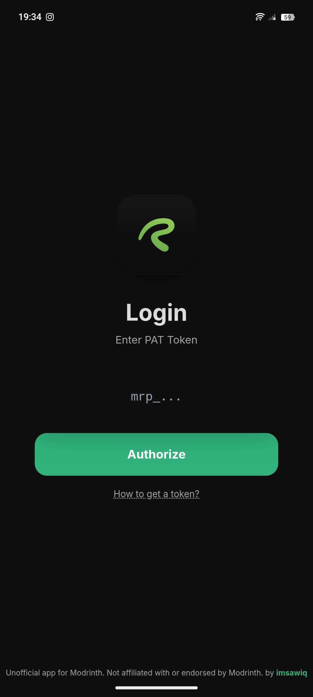
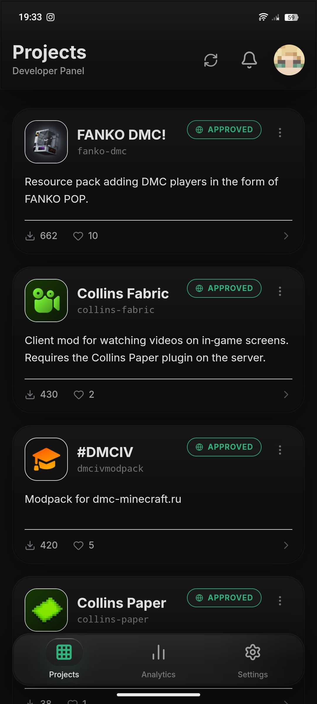
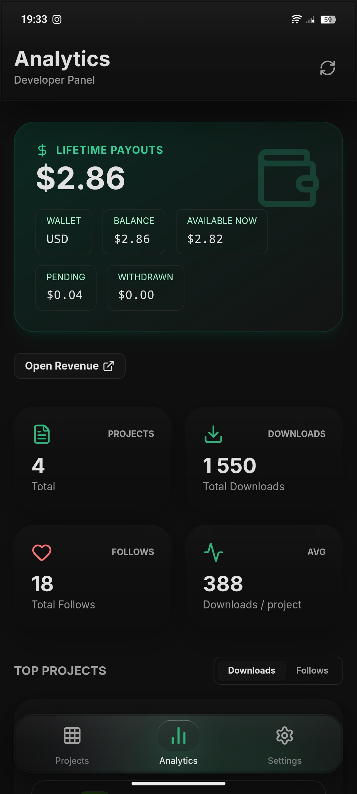

# Rinthy

<div align="center">
  
</div>

**EN** | [RU](#-русский)

Rinthy is a mobile app for Modrinth developers.

It helps you manage your projects and check analytics right from your phone.

**Disclaimer:** Unofficial app for Modrinth. Not affiliated with or endorsed by Modrinth.

## Screenshots

<div align="center">
  
  
  
</div>

## Features

- **Projects dashboard** (your projects list)
- **Project editing** (title/summary/description, links, status)
- **Project team management** (members)
- **Versions management** (view/edit versions)
- **Analytics overview** (downloads/follows)
- **Notifications** (unread notifications)
- **Profile editing** (username, bio, avatar)
- **Appearance settings** (theme, accent color)
- **RU/EN language support**
- **Balance view**

## Getting started (Local development)

### Requirements

- Node.js
- Android Studio (for Android builds)

### Install

```bash
npm install
```

### Run in browser (dev)

```bash
npm run dev
```

## Android build (Capacitor)

### Build web bundle

```bash
npm run build
```

### Sync assets to Android

```bash
npx cap sync android
```

### Open Android Studio

```bash
npx cap open android
```

### Run on device

From Android Studio: **Run**

## Authentication

Rinthy uses a Modrinth **Personal Access Token (PAT)**.

- Open: https://modrinth.com/settings/pats
- Create a new token
- Enable the required scopes (the app may ask you to enable all scopes)

**Security note:** the token is stored locally on your device.

---

# Русский

Rinthy — это мобильное приложение для разработчиков на Modrinth.

С помощью Rinthy можно управлять проектами и смотреть аналитику прямо с телефона.

**Дисклеймер:** неофициальное приложение для Modrinth. Не связано с Modrinth и не поддерживается ими.

## Скриншоты

<div align="center">
  
  
  
</div>

## Возможности

- **Список проектов**
- **Редактирование проекта** (название/краткое описание/описание, ссылки, статус)
- **Управление командой проекта** (участники)
- **Управление версиями** (просмотр/редактирование)
- **Аналитика** (загрузки/подписки)
- **Уведомления**
- **Редактирование профиля** (ник, био, аватар)
- **Настройки внешнего вида** (тема, основной цвет)
- **Поддержка RU/EN**
- **Просмотр баланса**

## Запуск локально

### Требования

- Node.js
- Android Studio (для сборки Android)

### Установка

```bash
npm install
```

### Запуск в браузере

```bash
npm run dev
```

## Сборка Android (Capacitor)

### Сборка web

```bash
npm run build
```

### Синхронизация в Android

```bash
npx cap sync android
```

### Открыть Android Studio

```bash
npx cap open android
```

## Авторизация

Нужен Modrinth **Personal Access Token (PAT)**:

- Открой: https://modrinth.com/settings/pats
- Создай новый токен
- Включи нужные права (иногда проще включить все галочки)

**Важно:** токен хранится локально на устройстве.
